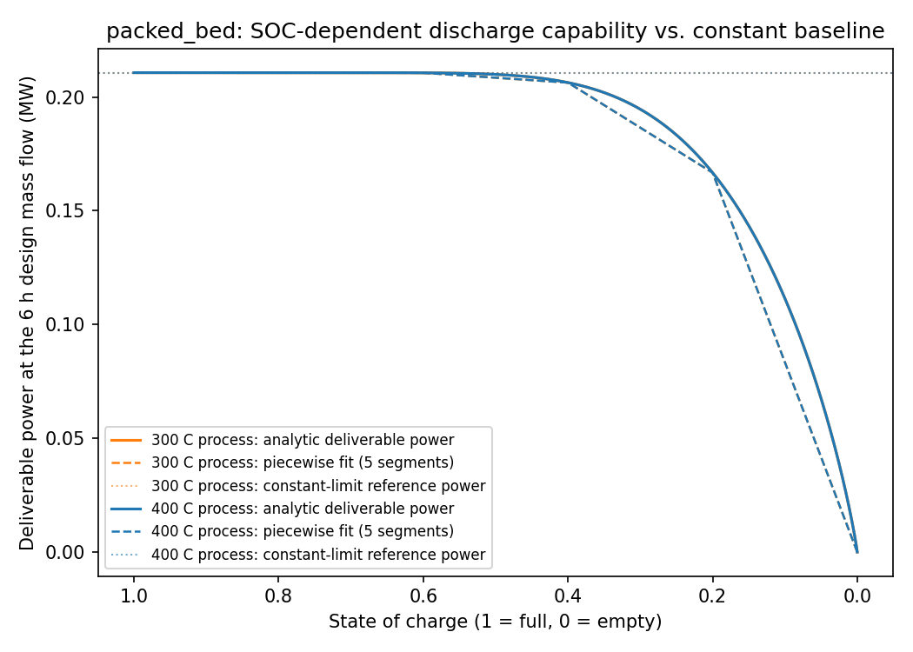
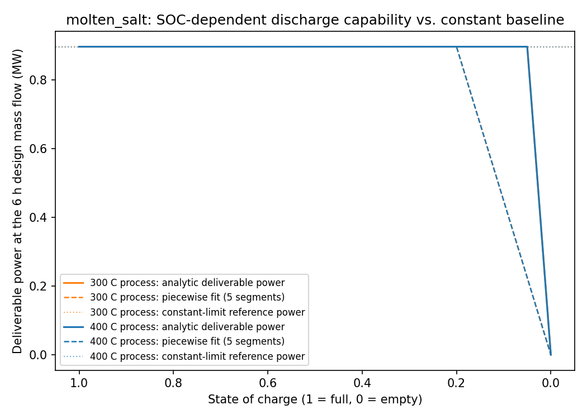
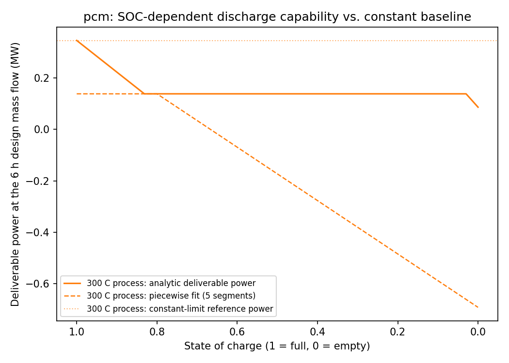

# tes-discharge-screen

[](https://github.com/abhijith-sivaprasadan/tes-discharge-screen/actions/workflows/ci.yml)
[](LICENSE)
[](pyproject.toml)

Techno-economic screening of thermal storage for industrial process heat, with
dynamically-informed discharge constraints.

**This is not:**

- **Not** a validated model of any real storage installation.
- **Not** a claim of expertise in high-temperature storage materials, containment,
  degradation or thermal cycling. The material property sets are literature values,
  clearly cited, used as inputs, not as contributions.
- **Not** a design tool. It is a screening framework.
- **Not** a claim that the SOC-dependent formulation is novel. Packed-bed
  thermoclines are extensively studied. The contribution, if any, is the systematic
  comparison of what the simplification costs across technologies under harmonised
  boundaries.

## The question

Annual techno-economic optimisation of thermal energy storage almost always
represents the store as an energy reservoir with a **constant** charge and discharge
power limit, the same way an electricity model represents a battery. For a
sensible-heat store serving a process at a fixed temperature, that is wrong: outlet
temperature falls as the store discharges, so deliverable power at or above the
process temperature declines with state of charge, and the last portion of stored
energy is unusable for that load. For two-tank molten salt and for latent (PCM)
storage, discharge temperature is roughly constant, so the simplification is close
to correct.

This project derives a state-of-charge-dependent discharge limit from a targeted
dynamic model, carries it into an annual optimisation as a piecewise-linear
constraint, and measures whether sizing conclusions or the technology ranking
change. A null result is a real result and will be reported first and plainly if
that is what comes out.

## Status

Phase 0 (scaffold and contracts) and Phase A (annual quasi-steady core,
constant discharge limit) are both done to their own exit criteria: see
[Phase A baseline results](#phase-a-baseline-results-flat-load-synthetic-priceload)
below. Phase B (targeted dynamic sub-model) is built for the packed-bed
technology only, matching the project's own priority (one technology fully
verified beats three unfinished): a Python shadow twin
(`packed_bed_dynamics.py`), a Modelica model of the identical physics
(`modelica/tes_screen/package.mo`), and an FMU export adapter (`fmu.py`).
No OpenModelica toolchain is available in this working environment, so the
Modelica model has been authored but not compiled, and the FMU-vs-shadow-twin
cross-check (this project's intended strongest verification story) has not
been run; the shadow twin's own correctness instead rests on three analytic
limits, all passing. See [Phase B](#phase-b-packed-bed-dynamic-sub-model)
below. Molten-salt and PCM now have their own dynamic sub-models too
(`molten_salt_dynamics.py`, `pcm_dynamics.py`) -- closed-form, not
time-stepped PDEs like the packed bed, so their own checks confirm the
implementation matches its own specified physics rather than checking
numerical accuracy against a known limit; neither has a Modelica twin or an
FMU cross-check. See [Phase C3](#phase-c3-full-technology-ranking-matrix)
below.

**Phase C3 (the full technology-ranking matrix) is done, and the answer is
plain: the SOC-dependent discharge-limit correction does not change which
technology is cheapest, anywhere in the matrix.** Across 5 valid
technology/temperature combinations (packed bed and molten salt at 300 C
and 400 C; PCM only at 300 C) x 3 synthetic load profiles -- 15 paired
cases, 30 solves, all optimal and independently verified -- packed bed
stays the cheapest technology under both the constant and the
SOC-dependent formulation, in every one of the 6 (temperature, profile)
groups. See [Phase C3](#phase-c3-full-technology-ranking-matrix) below for
the full table, including a genuinely surprising sub-finding: PCM's own
delta is exactly 0.000% everywhere, but not because its discharge-limit
shape does not matter -- at this matrix's matched design duration, PCM is
priced out of the market entirely (optimal storage capacity is exactly
0 MWh under both formulations, every profile), so its SOC-dependent
correction is never actually exercised.

**Scalar SOC is not shown to be a sufficient state, and this is reported
rather than hidden.** [P0.3](#p03-is-scalar-soc-a-sufficient-packed-bed-state)
constructs several bed states at matched total energy but different spatial
structure and finds near-term deliverable power scattering by up to 220%
(115% even restricted to states reachable by discharging alone) at the same
SOC -- so Phase B/C's discharge curve is a **trajectory-derived SOC
capability curve**, accurate along the one specific bed-state history it
was built from, not a validated general `Pmax(SOC)` law. This does not
invalidate Phase C/C2 below (both use exactly that one trajectory,
consistently), but it is a real limitation to carry forward, stated
explicitly rather than assumed away.

**Phase C (the paired experiment) is done at MVP scope**: one technology
(packed bed), one process temperature (300 C), one load profile (flat),
solved under both discharge-limit formulations. Its original run left the
two formulations with unequal sizing degrees of freedom, mixed the process
and return temperature references, and bound discharge capability by the
post-dispatch state rather than the pre-dispatch one (see the note at the
top of [Phase C](#phase-c-original-mvp-run-archived-diagnostic-only)),
which confounded "the discharge-limit shape changed" with "the two runs
were also allowed different durations," inflated deliverable power with
enthalpy already present in the return stream, and inflated the power the
SOC-dependent formulation appeared to need on top of both.
**[Phase C2](#phase-c2-matched-duration-family-experiment-the-corrected-comparison)**
fixes all three (roadmap P0.1, P0.2, and [P0.4](#p04-start-of-hour-vs-end-of-hour-discharge-capability)):
ties power to energy capacity at the same externally chosen duration in
both formulations, references deliverable power consistently to the
store's own return temperature, and bounds discharge capability by what
was actually on hand before each hour's own discharge. The isolated shape
effect is much smaller than Phase C's original number: a total-cost delta
ranging from +0.000% to +0.038% across a 2-12h duration sweep -- at the two
shortest durations, indistinguishable from the constant-limit baseline to
solver tolerance -- versus Phase C's original +0.22% at its own
(confounded, mis-referenced, over-conservative) durations. This was one
technology (packed bed) at one duration family, not yet a
technology-ranking comparison; **Phase C3 below closes that gap** across
every technology this project has a dynamic sub-model for, and finds the
ranking does not change there either.

Electricity prices are synthetic in every run so far: this working environment
has no `ENTSOE_API_KEY` configured, so the real ENTSO-E fetch path
(`electricity_price.py`, ported from PyNEXUS) is built and gated behind that
credential exactly the way PyNEXUS's own equivalent module is, but has not been
exercised against live data. Real ENTSO-E prices go negative at times, which a
pure LP with independent charge/discharge variables can exploit
pathologically; **[P0.5](#p05-preventing-pathological-simultaneous-cycling-under-negative-prices)**
adds an optional MILP operating-mode binary (`storage.cycling_prevention_mode
== "milp_binary"`) that prevents it, ahead of ever actually needing to run
against negative prices.

**The dispatch LP's own curve-rescaling assumption is now on a stated,
checked physical footing.** Every case in this repository rescales one
reference bed's fitted discharge curve linearly to whatever storage
capacity the LP actually sizes; **[P1](#p1-the-modular-area-scaling-law)**
gives that a specific geometric mechanism (`scale_parallel_bed`'s modular
area scaling) rather than an abstract "same duration ratio," and finds the
normalized curve collapses onto the reference *exactly* -- 0.0 deviation,
not just below tolerance -- across a 0.25x-4x sweep. See
[Sequencing](#sequencing) below.

## Governing rules

1. **Verified is not validated.** Verified means checked against its own physics, an
   analytic limit, or an independent hand calculation. Validated means checked
   against independent measured data. This project will contain a great deal of the
   first and none of the second.
2. **No result without a recorded solver status.** Every stored result carries
   solver name, termination condition, objective value, and wall time.
3. **Documentation ships in the same commit as the capability.** Not the next one.
4. **Never weaken the physics to make a test pass.**
5. **No number in a figure or table that cannot be traced** to a config file, a data
   provenance record, and a solver status.
6. **Assumptions live in config, never in source.** No magic constants.

## Phase A baseline results (flat load, synthetic price/load)

This is the constant-discharge-limit baseline only, not yet the SOC-dependent
comparison Phase C exists to produce, so there is no ranking finding to report
here: the numbers below show the model runs, solves to optimality, and passes
every independent check across all three technologies and both process
temperatures, on real (if synthetic-input) numbers rather than placeholders.

| Case | Termination | Annualised cost (EUR/yr) | Sized capacity (MWh-th) | Sized power (MW) | Max balance residual |
|---|---|---:|---:|---:|---:|
| packed_bed, 300 C | optimal | 3,992,456 | 54.99 | 7.42 | 8.9e-16 |
| molten_salt, 300 C | optimal | 4,071,018 | 36.80 | 4.85 | 8.9e-16 |
| pcm, 300 C | optimal | 4,172,472 | 13.80 | 4.85 | 8.9e-16 |
| packed_bed, 400 C | optimal | 3,992,456 | 54.99 | 7.42 | 8.9e-16 |
| molten_salt, 400 C | optimal | 4,071,018 | 36.80 | 4.85 | 8.9e-16 |

The cost ranking (packed bed cheapest, PCM most expensive) tracks the CAPEX
ranking in `docs/DATA.md` directly, which is the expected, sanity-checking
result for a model that is purely economic at this stage.

**A real limitation, stated rather than hidden:** the 300 C and 400 C rows for
each technology are numerically identical. `dispatch.py` never reads
`delivery_temperature_c`, `medium`, or `storage.temperature_max_c`/`min_c` -
Phase A's storage block is a temperature-agnostic MWh reservoir, exactly like
the constant-limit battery-style model this project's own opening thesis
describes as the flawed standard practice. Nothing in Phase A can move with
process temperature yet, by construction; that only becomes possible once
Phase B's dynamic sub-model derives an actual temperature-aware discharge
curve and Phase C wires it in. `tests/test_dispatch.py::test_process_temperature_has_no_effect_on_phase_a_result`
locks this in as an explicit, checked property rather than a silent surprise,
and is expected to need updating once Phase C lands.

**PCM was not run at 400 C.** Sodium nitrate's ~306 C melting point (the PCM
config's basis; `docs/DATA.md`) does not sit usefully close to a 400 C process:
no common nitrate-salt PCM composition was found with a high enough melting
point and useful latent heat in this session's research. Rather than force an
unfit config to get a sixth row, that combination is left undone until a
suitable high-temperature PCM composition is sourced.

Every case's full schedule, config, and solver/verification manifest:
`outputs/<case_name>/`.

## Phase B: packed-bed dynamic sub-model

A one-dimensional, two-phase (solid/fluid) transient model of the packed
bed's discharge (Schumann's 1929 formulation; `docs/DATA.md`), authored twice:
as a pure-Python shadow twin (`src/tes_screen/packed_bed_dynamics.py`) and as
a Modelica model of the identical governing equations
(`modelica/tes_screen/package.mo`), following OpenSteamOpt's shadow-twin
pattern. The twin's own correctness rests on three analytic limits (the build
spec's B4), all passing:

| Analytic check | Result |
|---|---|
| Zero draw rate, zero loss: outlet stays at the initial (charged) temperature | pass, exact to 1e-9 C |
| Infinite heat transfer coefficient: single-node bed reduces to a well-mixed tank's closed-form exponential response | pass, matches to 1e-3 relative / 1e-2 C absolute |
| Energy conservation: cumulative outlet enthalpy flow equals stored-energy loss | pass, to 1e-9 relative (near machine precision) |

Discharge curves (state of charge vs. deliverable power) were generated at
three draw rates and committed with their generating bed config:
`outputs/packed_bed_dynamics/`. **Call this a trajectory-derived SOC
capability curve, not a universal packed-bed `Pmax(SOC)` law** (roadmap
P0.3's own documentation-language instruction): it comes from one specific
trajectory (a fully-charged, spatially uniform bed, discharged continuously
at one mass flow), and [P0.3](#p03-is-scalar-soc-a-sufficient-packed-bed-state)
below finds real evidence that total stored energy alone does not determine
near-term deliverable power for other, differently-shaped bed states at the
same total energy.

**Temperature semantics (roadmap P0.2).** `discharge_power_curve` separates
three temperatures an earlier version of this module conflated: `T_process`
(the process's service temperature), `delta_T_min_hot_side` (minimum
heat-exchanger approach above it, `0.0` throughout this repository --
`docs/DATA.md`'s own [assumption] note), and `T_return` (the HTF
temperature entering the bed, an explicit simulation input, never derived
from `T_process`). `storage_heat_mw` (net thermal power extracted from the
bed, `m_dot * cp * (T_out - T_return)`) is referenced to the same
temperature the bed's own stored-energy accounting uses, so a fully
depleted bed reports exactly zero rather than a negative number that
happened to get clipped, and integrating it against time now reproduces
the bed's own stored-energy drop (checked directly, not assumed:
`test_integrated_storage_heat_matches_the_beds_own_stored_energy_drop`).
`deliverable_power_mw` then applies a quality gate on top of that --
zero whenever the outlet cannot clear `T_required_out = T_process +
delta_T_min_hot_side`, even though the bed still holds recoverable
sensible energy at that point -- and it is this gated stream, not the
ungated `storage_heat_mw`, that Phase C's piecewise construction fits and
the dispatch LP sees. Before this fix, deliverable power was computed
against `T_process` while stored energy was computed against `T_return`,
so whenever the two differed, enthalpy already present in the return
stream was counted as if storage had supplied it -- inflating every
SOC-dependent sizing result derived from this curve, including Phase C's
original one.

**What has not been done, and why -- confirmed, not just assumed (roadmap
P4).** No OpenModelica toolchain (`omc`) is installed in this working
environment, so the Modelica model above has been authored but never
compiled, and the FMU-vs-shadow-twin cross-check that the build spec calls
"the single strongest verification story available here" has not been
run. This was re-checked directly (not re-asserted from an earlier
session's note): `apt-cache search openmodelica` finds no package in this
container's default repositories, and the container's own outbound
network gateway returns a hard `403` to OpenModelica's own distribution
host (`build.openmodelica.org`) and to Ubuntu's `ppa.launchpadcontent.net`
mirror -- an allowlist-based policy, not a transient failure, so no retry
or alternative mirror would succeed either. `fmu.py` (ported from
OpenSteamOpt's identical `find_omc()` pattern) fails loudly and
specifically when the toolchain is absent rather than silently skipping;
`tests/test_modelica_contract.py` statically checks the authored Modelica
source instead, the same toolchain-independent pattern OpenSteamOpt itself
uses for CI. Molten-salt and PCM now have their own closed-form dynamic
sub-models (see Phase C3), but neither has a Modelica twin: only packed
bed's physics was judged to justify one, and a compiled cross-check for it
remains blocked by the same environment constraint.

## P0.3: is scalar SOC a sufficient packed-bed state?

A packed bed is a distributed-temperature system: two beds holding the same
total stored energy can have that energy arranged very differently along
the bed (a sharp thermocline near one end vs. a broad, smeared one), and
Phase B/C's discharge curve reads deliverable power off total energy alone,
from a single trajectory. Whether that is actually a safe reduction --
whether scalar SOC is *sufficient* to predict near-term outlet capability,
not just correlated with it along the one trajectory the curve was fit from
-- is an empirical question the single-trajectory construction cannot
answer by itself. The roadmap's own short-term research test (P0.3) checks
this directly, rather than assuming it.

**The finding, stated first and plainly, and not softened: scalar SOC is
not a sufficient state for this bed model.** `state_sufficiency.py`
constructs four temperature fields at matched total energy (uniform,
`step_hot_at_inlet`, its mirror image `step_hot_at_outlet`, and a broad
`smeared` ramp -- same energy, different spatial arrangement, by
construction; see the module for exactly how) at three energy fractions
(0.3, 0.5, 0.7), discharges each briefly (30 minutes, ~1.5-2.5% of a full
breakthrough discharge, at the same mass flow and return temperature every
time: `scripts/run_state_sufficiency_experiment.py`), and reads deliverable
power off each at several short-term checkpoints. At fixed total energy,
deliverable power ranges as widely as **~0 MW to ~0.26 MW** across the
profile family -- a relative scatter (max-min)/mean of up to **220%** at
some (energy fraction, checkpoint) pairs, against an explicit 5% threshold
this experiment would have needed to stay under to call scalar SOC
adequate. Even restricted to the three profiles reachable by discharging
alone (excluding `step_hot_at_inlet`, which places the hot block where cold
fluid enters first -- not reachable without an external recharge or mixing
step, since a real discharge always erodes from the inlet), the scatter is
still **up to 115%**. Both numbers, and the full per-(energy fraction,
checkpoint, profile) table, are in `outputs/state_sufficiency/`.

**Why, physically.** At a short time horizon, near-term deliverable power
is governed mainly by how much hot material sits immediately upstream of
the outlet, not by the bed's total energy content. `step_hot_at_outlet`
puts hot material right at the outlet, so it stays near full power for the
whole 30-minute window regardless of how little energy the rest of the bed
holds; `step_hot_at_inlet` puts the same total energy where the incoming
cold fluid meets it first, so a warming front has to propagate the length
of the bed before any of it reaches the outlet at all, and in this
30-minute window essentially none of it does. Total energy is the same;
near-term capability is not remotely the same.

**What this does and does not mean for Phase C/C2.** It does not invalidate
those results: Phase C/C2's own trajectory (a uniform, fully-charged bed
discharging continuously) is one specific, reachable state history, and the
curve is accurate along that specific history -- the piecewise
construction's own safety checks (against that trajectory's actual data)
still hold. What it does mean is that the curve should not be read as a
general `Pmax(SOC)` relation that would also hold for a bed reaching the
same SOC by a different route (partial discharge/recharge cycling, for
instance) -- exactly the caveat the roadmap asks this project to carry
until a state-sufficiency test exists. It also flags a specific, concrete
limitation for any future work that lets the annual LP's storage cycle
partially (charge and discharge within an hour, or repeatedly): the
piecewise limit currently used would not necessarily be trustworthy there,
since it was never tested against non-uniform states at all.

**Per the roadmap's own instruction not to hide a negative result here**:
this is reported as a real, structural limitation of the scalar-SOC
reduction for this bed model, not rounded down or explained away. A fifth
profile family the roadmap names (states drawn from realistic
charge/discharge histories) needs a charging dynamic model this project
does not have and is left undone rather than approximated; see
`state_sufficiency.py`'s own module docstring.

## Phase C (original MVP run): archived, diagnostic only

**This section documents the project's original paired run, kept for the
record. It is superseded by [Phase C2](#phase-c2-matched-duration-family-experiment-the-corrected-comparison)
as the paired comparison of discharge-limit shape and should not be read as
this project's current headline finding.** The run below let each
formulation pick its own power rating independently: the constant-limit
baseline's power was a free decision variable, while the SOC-dependent
case tied charge power to the discharge curve's own fixed power/energy
ratio. Reading its own committed manifest back, this meant the two runs
being compared were not actually the same duration of storage: the
constant-limit run solved to a 7.41h store (54.99 MWh / 7.42 MW) and the
SOC-dependent run to a 3.88h store (50.43 MWh / 12.98 MW). Part of the
"SOC-dependent needs 75% more power" result below is therefore duration,
not discharge-limit shape -- the two things this comparison was meant to
isolate were never actually separated. The data and numbers below are
unchanged from the original run (not deleted, per this project's own rule
against overwriting evidence); the finding they were used to support has
been withdrawn in favour of Phase C2's matched comparison.

**The finding, stated first and plainly:** for packed bed at 300 C with a
flat load profile, replacing the constant discharge limit with the
SOC-dependent one increases annualised total cost by **0.22%** (+8,823
EUR/yr on a ~4.0M EUR/yr baseline), decreases the optimal storage energy
capacity by **8.3%** (54.99 to 50.43 MWh-th), and increases the required
power capacity by **75%** (7.42 to 12.98 MW). This is a real but modest
effect for this one case, not a dramatic one and not a null one: the
constant-limit simplification understates how much power capability a
packed bed needs to deliver the same load, which is exactly the direction
this project's hypothesis predicted, at a scale worth stating honestly
rather than rounding up or down.

This is the MVP the build spec's own section 10 and 8 describe as "a
complete piece of work": one technology (packed bed), one process
temperature (300 C), one load profile (flat), both discharge-limit
formulations, solved and independently verified. It is **not** the full
18-run matrix (3 technologies x 2 temperatures x 3 profiles): only packed
bed has a Phase B dynamic sub-model, so there is no second technology to
rank against yet, and "does the technology ranking change" is not
answerable from this result.

| | Constant limit (Phase A baseline) | SOC-dependent (Phase C) | Delta |
|---|---:|---:|---:|
| Termination | optimal | optimal | |
| Annualised total cost (EUR/yr) | 3,992,456 | 4,001,279 | +8,823 (+0.22%) |
| Storage energy capacity (MWh-th) | 54.99 | 50.43 | -4.56 (-8.3%) |
| Storage power capacity (MW) | 7.42 | 12.98 | +5.57 (+75.0%) |
| Backup fuel cost (EUR/yr) | 1,035,235 | 1,028,777 | -6,459 |
| Electricity cost (EUR/yr) | 2,497,270 | 2,508,949 | +11,678 |
| Emissions (tCO2/yr) | 5,228 | 5,195 | -33 |
| Solve time | 8.3 s | 22.5 s | |

**The piecewise construction and its safety, checked, not assumed.**
Following the same technique as OpenSteamOpt's boiler fuel curve
(`rto.py`), the discharge curve becomes a small set of linear constraints,
`p_dis[t] <= a_i*level[t] + b_i*E_cap` for every segment `i`
simultaneously, kept strictly linear even with storage energy capacity as
a free decision variable by tying the fitted curve's power/energy ratio to
`E_cap` rather than treating power and energy capacity as independent
(charge power is tied the same way when unfixed, so the two runs compare
on equal footing: same sizing degrees of freedom, only the discharge
constraint itself differs). This construction is exact for a concave curve
and only ever safe (never overestimates deliverable power) for one; the
packed-bed discharge curve is empirically concave (flat near full charge,
steepening toward depletion), checked against the underlying data at 3,
5, 8, and 12 segments, not assumed from the curve's shape.

**More segments barely changes the answer**, exactly per the build spec's
own C1 instruction to check this: sized capacity and power were identical
(50.43 MWh, 12.98 MW) at every segment count from 3 to 12, and total cost
varied by under 350 EUR (under 0.01%) across that range. 5 segments (the
spec's own suggested default) is what the headline table above uses.

Every number above traces to `outputs/phase_c_packed_bed_300c_flat/`:
both hourly schedules, the fitted curve's breakpoints, and a manifest with
both runs' solver status, every verification check's pass/fail, and the
full segment-count robustness table.

## Phase C2: matched-duration-family experiment (the corrected comparison)

**The finding, stated first and plainly:** once both formulations are tied
to the same design duration (`storage.design_duration_hours`, so power is
always `E_cap / tau` in both, identically), deliverable power is referenced
consistently to the store's own return temperature rather than mixed with
the process temperature, and the discharge-capability constraint reads the
pre-dispatch state rather than the post-dispatch one (P0.1, P0.2, and P0.4,
all applied here), the isolated effect of the SOC-dependent discharge limit
is much smaller than Phase C's original (confounded, unequal-duration,
mis-referenced, and overly conservative) estimate. Swept across five design
durations from 2h to 12h, the SOC-dependent formulation costs
**+0.000% to +0.038%** more than the constant-limit baseline at the same
duration -- at the two shortest durations, indistinguishable from the
constant-limit baseline to solver tolerance -- against the +0.22% Phase C
originally reported, and smaller again than the +0.013%-to-+0.080% range
P0.1+P0.2 alone (without P0.4) produced.

| Design duration (tau) | Constant limit cost (EUR/yr) | SOC-dependent cost (EUR/yr) | Delta | Constant E_cap (MWh) | SOC-dependent E_cap (MWh) |
|---:|---:|---:|---:|---:|---:|
| 2h | 4,019,225.76 | 4,019,225.76 | +0.000% | 45.87 | 45.87 |
| 4h | 4,000,234.86 | 4,000,235.89 | +0.000% | 50.43 | 50.43 |
| 6h | 3,993,618.08 | 3,994,416.32 | +0.020% | 54.99 | 55.20 |
| 8h | 3,992,555.33 | 3,993,991.36 | +0.036% | 54.99 | 56.94 |
| 12h | 3,996,426.99 | 3,997,959.30 | +0.038% | 60.75 | 62.46 |

All ten runs (five durations x two formulations) solved to `optimal` and
passed every independent verification check. The headline duration (6h,
chosen as a round middle point of the sweep, not cherry-picked for
magnitude) is tabulated in full below; every duration's fitted curve
safety, solver status, and delta is in the run manifest.

| | Constant limit (tau=6h) | SOC-dependent (tau=6h) | Delta |
|---|---:|---:|---:|
| Termination | optimal | optimal | |
| Annualised total cost (EUR/yr) | 3,993,618.08 | 3,994,416.32 | +798.24 (+0.020%) |
| Storage energy capacity (MWh-th) | 54.99 | 55.20 | +0.22 (+0.4%) |
| Storage power capacity (MW) | 9.16 | 9.20 | +0.04 (E_cap/tau, so it moves with E_cap) |
| Backup fuel cost (EUR/yr) | 1,014,756.09 | 1,021,514.11 | +6,758.02 |
| Electricity cost (EUR/yr) | 2,524,452.26 | 2,515,586.48 | -8,865.78 |
| Emissions (tCO2/yr) | 5,124.52 | 5,158.65 | +34.13 |
| Solve time | 8.8 s | 21.6 s | |

**Why P0.4 shrinks the gap further.** `dispatch.py`'s piecewise
discharge-capability constraint used to bound `p_dis[t]` using `level[t]`,
the *post*-dispatch state the storage balance defines in terms of that same
hour's own `p_dis[t]` -- backwards, since capability at the start of an hour
should depend on what was on hand before that hour's own discharge drew it
down. Reading the correct, pre-dispatch state (`level_start[t]`, always at
least as large as `level[t]` whenever that hour is a net discharge) relaxes
the bound, so the SOC-dependent formulation now needs less headroom to
deliver the same load than the uncorrected constraint implied -- shrinking
the apparent penalty at every duration, and making it disappear to solver
tolerance at 2h and 4h. See [P0.4](#p04-start-of-hour-vs-end-of-hour-discharge-capability)
below for the full mechanism and a short-horizon case where the effect is
large enough to flip which formulation needs more power outright.

**Why energy capacity (and, through it, power) can still differ between the
two formulations at every tau in this table.** `design_duration_hours` ties
power to `E_cap / tau` identically in both -- the one degree of freedom
Phase C's original run left unequal -- but `E_cap` itself is still a free
decision variable in each formulation, and the SOC-dependent curve's power
still declines with state of charge (that is the whole discharge-limit
shape this comparison is meant to isolate), so the optimiser leans on a
somewhat larger store to compensate. That the gap it needs is now this
small, once every other confound is corrected, is itself the headline
result.

**How the matched curves were built.** For each swept tau, the discharge
mass flow is solved for directly (`discharge_curve.mass_flow_for_target_duration`)
so the resulting curve's own reference power/energy ratio already equals
`1/tau`, then the bed is re-simulated at that mass flow and a fresh
piecewise curve fit -- a curve genuinely specific to that duration, not one
curve rescaled after the fact. `dispatch.py`'s `duration_matched` branch
checks this equality at model-build time and refuses a mismatched curve
rather than silently accepting one. Deliverable power (and, through
`mass_flow_for_target_duration`, the reference power this solves against)
is computed per P0.2: referenced to the bed's own return temperature
`T_return`, with a quality gate at `T_process + delta_T_min_hot_side`
(`delta_T_min_hot_side = 0` here; see docs/DATA.md) applied on top, rather
than mixing the process and return temperature references the way Phase C's
original run did; the discharge-capability constraint itself uses
`storage.discharge_capability_reference = "start_of_hour"` per P0.4.

**A solver note, not a modelling one.** At 7-9h durations, P0.4's corrected
(less self-damped) formulation turned out to be numerically harder for
HiGHS's default simplex method on this particular curve shape -- not
infeasible, just slow enough that a couple of durations near tau=8h failed
to find any feasible solution within the configured time limit. Switching
`solve_dispatch`'s solver option to HiGHS's interior-point method (every
decision variable in this model is continuous, so IPM is a legitimate,
generally-applicable choice, not a one-off workaround) resolves it,
verified to reproduce the identical objective value on every
already-passing case, not just paper over the new one.

Every number above traces to `outputs/phase_c2_duration_matched/`: the
headline (6h) duration's hourly schedules and fitted curve breakpoints, and
a manifest with every swept duration's solver status, KPIs, verification
checks, and curve-fit safety numbers.

This was one technology (packed bed) at one duration family; see
[Phase C3](#phase-c3-full-technology-ranking-matrix) below for the same
correction applied across every technology, temperature, and load profile
this project has a dynamic sub-model for.

## Phase C3: full technology-ranking matrix

**The finding, stated first and plainly: the SOC-dependent discharge-limit
correction does not change which technology is cheapest, anywhere in this
matrix.** This is the question Phase C2 explicitly could not answer (only
packed bed had a Phase B dynamic sub-model): with `molten_salt_dynamics.py`
and `pcm_dynamics.py` now built (this session), every technology this
project can model is compared, at every process temperature it is
configured for, under every synthetic load profile, all at the same
matched design duration (`storage.design_duration_hours = 6h`, P0.1's
sizing fix) and the same P0.2/P0.4 corrections Phase C2 established.

**Scope: 5 valid technology/temperature combinations, not 6.** Packed bed
and molten salt each have a 300 C and a 400 C case; PCM only has a 300 C
case (sodium nitrate's ~306 C melting point does not sit usefully close to
a 400 C process, and no suitable high-temperature nitrate-salt PCM
composition was found -- `configs/pcm_300c_flat.yaml`'s own comment,
unchanged by this experiment). x 3 load profiles (`flat`, `two_shift`,
`seasonal`, `synthetic_profiles.py`) = **15 paired cases, 30 solves, every
one `optimal` and independently verified.**

| Temperature | Profile | Technologies compared | Cheapest (constant) | Cheapest (SOC-dependent) | Ranking flipped? |
|---:|---|---|---|---|:---:|
| 300 C | flat | molten_salt, packed_bed, pcm | packed_bed | packed_bed | No |
| 300 C | two_shift | molten_salt, packed_bed, pcm | packed_bed | packed_bed | No |
| 300 C | seasonal | molten_salt, packed_bed, pcm | packed_bed | packed_bed | No |
| 400 C | flat | molten_salt, packed_bed | packed_bed | packed_bed | No |
| 400 C | two_shift | molten_salt, packed_bed | packed_bed | packed_bed | No |
| 400 C | seasonal | molten_salt, packed_bed | packed_bed | packed_bed | No |

Packed bed is cheapest in every group, under both formulations. The full
per-case deltas behind that table:

| Technology | Temp (C) | Profile | Constant cost (EUR/yr) | SOC-dependent cost (EUR/yr) | Delta | Delta E_cap (MWh) |
|---|---:|---|---:|---:|---:|---:|
| packed_bed | 300 | flat | 3,993,618.08 | 3,994,416.32 | +0.020% | +0.22 |
| packed_bed | 300 | two_shift | 2,800,872.52 | 2,801,143.76 | +0.010% | +0.49 |
| packed_bed | 300 | seasonal | 2,874,718.59 | 2,875,603.49 | +0.031% | +0.55 |
| packed_bed | 400 | flat | 3,993,618.08 | 3,994,416.32 | +0.020% | +0.22 |
| packed_bed | 400 | two_shift | 2,800,872.52 | 2,801,143.76 | +0.010% | +0.49 |
| packed_bed | 400 | seasonal | 2,874,718.59 | 2,875,603.49 | +0.031% | +0.55 |
| molten_salt | 300 | flat | 4,075,713.26 | 4,075,957.34 | +0.006% | ~0.00 |
| molten_salt | 300 | two_shift | 2,944,030.16 | 2,944,140.94 | +0.004% | 0.00 |
| molten_salt | 300 | seasonal | 2,991,108.49 | 2,991,423.82 | +0.011% | +0.07 |
| molten_salt | 400 | flat | 4,075,713.26 | 4,075,957.34 | +0.006% | ~0.00 |
| molten_salt | 400 | two_shift | 2,944,030.16 | 2,944,140.94 | +0.004% | 0.00 |
| molten_salt | 400 | seasonal | 2,991,108.49 | 2,991,423.82 | +0.011% | +0.07 |
| pcm | 300 | flat | 4,178,028.84 | 4,178,028.84 | +0.000% | 0.00 |
| pcm | 300 | two_shift | 3,059,527.90 | 3,059,527.90 | +0.000% | 0.00 |
| pcm | 300 | seasonal | 3,132,422.34 | 3,132,422.34 | +0.000% | 0.00 |

**Molten salt's own correction is smaller than packed bed's at every
matched (temperature, profile) pair** (e.g. 300 C flat: +0.006% vs.
+0.020%) -- consistent with this project's own opening hypothesis and the
control-case comment already in `configs/molten_salt_300c_flat.yaml`
("molten salt discharges at a near-constant temperature, so the
SOC-dependent correction should barely move it"). It is not literally
zero: `molten_salt_dynamics.py`'s own `heel_fraction` taper (deliverable
flow declining linearly across the last 5% of tank inventory,
[assumption]) does occasionally bind, which is why the two-tank model's
own delta is small but nonzero rather than exactly 0.

**PCM's delta is exactly 0.000% in every case, but for a reason that must
not be glossed over: the model builds exactly zero PCM storage capacity at
this matched design duration, under both formulations, in every profile.**
`outputs/phase_c_full_matrix/run_manifest.json` shows `e_cap_mwh` at
(numerically) 0 for all six PCM entries. PCM's combined capex
(80,000 EUR/MWh-th + 40,000 EUR/MW, `configs/pcm_300c_flat.yaml`) is far
above packed bed's (7,000 + 20,000) and molten salt's (26,000 + 60,000);
at `design_duration_hours = 6h`, tying required power directly to
`E_cap / 6`, it is cheaper for the optimiser to serve the load entirely
from the electric heater and backup boiler than to build any PCM storage
at all. **The SOC-dependent discharge-limit correction is therefore never
actually exercised for PCM in this matrix** -- its "delta = 0.000%" is a
sizing artifact of this specific design duration and cost structure, not
evidence that PCM's three-regime discharge shape is inconsequential. A
shorter or longer design duration, or different PCM capex assumptions,
could change this; that sweep was not run here.

**Why the 300 C and 400 C rows are pairwise identical for packed bed and
for molten salt.** This is expected, not a bug, and traces to this specific
matrix's own parameter choices, the same way the already-documented Phase A
temperature-agnostic-dispatch limitation does:

- **Packed bed:** `configs/packed_bed_300c_flat.yaml`
  (`temperature_max_c=400`, `temperature_min_c=320`) and
  `packed_bed_400c_flat.yaml` (`500`/`420`) both have exactly the same
  80 C span, and the bed model has no absolute-temperature dependence
  (constant material properties) -- so the simulated normalized discharge
  curve is identical between the two cases, and so is every downstream
  number.
- **Molten salt:** `molten_salt_dynamics.py` deliberately holds the hot/cold
  tank temperatures fixed at 565 C/290 C for both process-temperature
  cases (see the module's own docstring), since the two YAML configs use
  `temperature_min_c` for two different concepts and only
  `process_temperature_c` should vary between them. Process temperature
  enters the curve only through a pass/fail quality gate that both 300 C
  and 400 C clear trivially (565 C comfortably exceeds either), so the two
  temperature cases are, by this model's own construction, the same case.

**The headline, restated plainly.** Once matched-duration sizing (P0.1),
consistent temperature referencing (P0.2), and start-of-hour discharge
capability (P0.4) are all applied, the SOC-dependent discharge-limit
correction moves total annualised cost by at most +0.031% anywhere in this
15-case matrix, never changes which technology is cheapest in any of the 6
(temperature, profile) groups, and for two of the three technologies
(molten salt, and especially PCM) the effect is smaller still or entirely
unexercised. The technology ranking Phase A's constant-limit baseline
already found (packed bed cheapest, PCM most expensive) is unchanged by
moving to the corrected SOC-dependent model.

**One figure per technology**, each overlaying the analytic deliverable-power
curve, its 5-segment piecewise fit, and the constant-limit reference power,
at every process temperature that technology has:





The packed-bed and molten-salt figures visibly confirm the "pairwise
identical" note above: their 300 C and 400 C curves are drawn exactly on
top of each other. The PCM figure shows the three-regime shape
(superheat ramp, latent plateau, subcooled ramp) the piecewise fit
approximates -- worth looking at even though, per the finding above, the LP
never actually built any PCM capacity to use it against.

**How this was built.** `scripts/run_phase_c_full_matrix_experiment.py`
builds one discharge curve per (technology, temperature) combination --
reused across all three load profiles, since the curve depends on the
technology's own physics and process temperature, not on how demand varies
over the year -- via each technology's own `mass_flow_for_target_duration`
at `tau = 6h` (mirroring `discharge_curve.mass_flow_for_target_duration`'s
closed-form approach for packed bed; `molten_salt_dynamics.py` and
`pcm_dynamics.py` each implement their own), then fits it through the same
technology-agnostic piecewise construction
(`discharge_curve.fit_piecewise_curve_from_power_curve`) all three
technologies now share. Every fit's overestimate against its own source
curve is at most 4.3e-6 MW (packed bed; molten salt and PCM both exactly
0.0), confirmed in the run manifest, not assumed. Every number above
traces to `outputs/phase_c_full_matrix/`: `case_deltas.csv` (the 15-row
per-case table), `ranking_table.csv` (the 6-row ranking-flip table),
`run_manifest.json` (every case's full KPIs, solver status, and
verification result), and `figures/`.

## P0.4: start-of-hour vs. end-of-hour discharge capability

**The bug.** `dispatch.py`'s piecewise discharge-capability constraint,
`p_dis[t] <= a_i*level_ref[t] + b_i*E_cap`, used `level[t]` as `level_ref[t]`
-- but `level[t]` is the *post*-dispatch state: `storage_balance`'s own
equation defines it in terms of that same hour's `p_dis[t]` and `p_ch[t]`.
Physically, what an hour's discharge is *capable of* should depend on what
was actually on hand before that hour's own discharge drew it down --
`level_start[t]` (`soc_init_fraction * E_cap` at `t=0`, `level[t-1]`
otherwise, the same "previous" term `storage_balance` already computed) --
not what's left over afterward.

**Why this mattered, not just as a technicality.** Because the curve is
increasing in level (more stored energy, more deliverable power), and
discharging only ever lowers the level within an hour, bounding `p_dis[t]`
by the *smaller*, post-discharge `level[t]` made the constraint tighter than
physically justified whenever an hour was a net discharge -- self-
referentially so, since `level[t]` is itself defined in terms of `p_dis[t]`.
Substituting the storage balance into the constraint shows the effective
bound was the correct (start-of-hour) one divided by `(1 + a_i/eta_discharge)`
-- always a shrinkage, never a relaxation. This directly inflated how much
power capacity the SOC-dependent formulation appeared to need relative to
the constant-limit baseline, on top of the separate P0.1 and P0.2 confounds.

**The fix, and why it stays an explicit choice, not a silent replacement.**
`storage.discharge_capability_reference` (`"start_of_hour"` or
`"end_of_hour"`) is a new required config field, validated exactly like
`discharge_limit_mode`: required when `discharge_limit_mode ==
"soc_dependent"`, must be null otherwise (the constant limit doesn't depend
on level at all, so a given value there would mean nothing).
`dispatch.py`'s `build_model` defensively re-checks this too, not just
`config.py`'s loader, since `build_model` is public API tests and scripts
call directly on hand-built configs -- an invalid or missing value must
never silently fall back to one behaviour or the other. Both remain fully
supported: this is a modelling choice with a roadmap-recommended default for
this screening model (`start_of_hour`), not a bug that only had one correct
fix.

**Quantified, per the roadmap's own acceptance criterion**, at a short
72-hour horizon with nearly-free storage economics (forcing both
formulations to actually build storage rather than collapsing to
`E_cap = 0`): switching from `end_of_hour` to `start_of_hour` drops the
SOC-dependent formulation's required power rating from 10.38 MW to 9.60 MW
-- enough to flip which formulation needs more power than the other
outright, since the constant-limit baseline needs exactly 10.0 MW (its own
free-sizing decision variable, unaffected by this fix) at this case.
`end_of_hour` needing *more* power than the constant baseline matches Phase
C's original framing; `start_of_hour` needing *less* undercuts that framing
as itself partly an artifact of this bug, not a robust physical result on
its own. `tests/test_dispatch.py`'s P0.4 test block reproduces this
exactly, alongside a build-time check confirming an invalid or missing
`discharge_capability_reference` is rejected rather than silently
defaulted, and a pair of curve-safety checks confirming each reference mode
is verified against the state it actually uses (checking `end_of_hour`'s
solved discharge against the post-dispatch level, and `start_of_hour`'s
against the independently reconstructed pre-dispatch one, not the same
column for both).

## P0.5: preventing pathological simultaneous cycling under negative prices

**The problem, reproduced, not just theorised about.** A pure LP with
independent nonnegative `p_ch[t]`/`p_dis[t]` variables can exploit negative
electricity prices: draw heater electricity purely to collect the
negative-price payment, discharge the store in the same hour to make room
for it in the heat balance, then charge the store right back up beyond what
`c_charge_limit` alone would allow. Mathematically feasible, physically
meaningless, and it burns real round-trip losses (`eta_charge`,
`eta_discharge`) for no net storage benefit -- and with real ENTSO-E data
(not yet fetched in this working environment; see Status above), negative
hours actually occur. Given a case with generous headroom (large heater
capacity, sizeable charge/discharge power, moderate round-trip efficiency)
and a deep negative-price window, this reproduces exactly: the LP charges
at its full 20 MW limit while simultaneously discharging 13-18 MW, hour
after hour, with the store pinned at full capacity throughout -- not
storing and releasing energy, just churning it to launder negative-price
electricity.

**The fix.** `storage.cycling_prevention_mode` (`"none"` or
`"milp_binary"`) is a new required config field. `"milp_binary"` adds a
per-hour binary `z[t]` and two constraints,
`p_ch[t] <= charge_power_bound_mw * z[t]` and
`p_dis[t] <= discharge_power_bound_mw * (1 - z[t])`, forcing at most one
direction active per hour -- the roadmap's own preferred, "research-grade"
option (explicitly not wasted effort, since the target KTH project values
MILP formulations). `"none"` keeps the original LP available, unchanged,
for nonnegative-price diagnostics (every case config in this repository
still uses it; none of them carry negative prices).

**A modelling subtlety the naive version of this fix gets wrong.** The
textbook big-M pattern needs `M` to be a genuine numeric constant. But
`p_ch_max` in this model is very often itself a Pyomo *expression* in a
sizing variable (`E_cap/tau`, `discharge_curve.k * E_cap`, or `P_rated`
directly) -- using it as `M` in `p_ch_max * z[t]` would multiply two
variables together, a nonlinear term no MILP solver can handle.
`charge_power_bound_mw`/`discharge_power_bound_mw` are computed as genuine
numeric constants instead, built from the same numeric bounds already
declared for `E_cap`/`P_rated`'s own domains (`peak * 24 * 10` MWh,
`peak * 5` MW) rather than an arbitrary big number -- the roadmap's own
"use defensible capacity bounds" instruction, followed literally.

**Quantified, per the roadmap's own acceptance criteria**
(`tests/test_dispatch.py`'s P0.5 block): in the reproducing case above (a
10-hour deep-negative-price window), the LP mode shows 5 hours of material
simultaneous charge and discharge; `milp_binary` shows zero. The MILP
formulation still terminates optimal and passes every independent
verification check under the negative-price profile ("negative price tests
behave sensibly"). Its total cost (68,203 EUR) is provably never lower than
the LP's own (the MILP constraints are a strict restriction of the LP's
feasible region -- true by construction, not just observed) and is indeed
measurably higher than the LP's (66,734 EUR), confirming the LP's
apparently cheaper answer was exactly the exploited pathology's value, not
a genuinely better dispatch MILP is leaving on the table. The original LP
mode continues to solve and verify normally under ordinary nonnegative
synthetic prices, exactly as every other case in this repository already
relies on.

## P1: the modular-area-scaling law

**The assumption, stated plainly for the first time.** The dispatch LP
rescales one reference bed's fitted discharge curve to whatever storage
energy capacity a case actually sizes, linearly
(`p_dis[t] <= a_i*level[t] + b_i*E_cap`) -- implicitly assuming the
*normalized* curve (state of charge vs. fraction of full-charge power) has
the same shape at any physical bed size, not just the one the reference
bed happens to be. Every result in this repository already depends on this
holding; before P1 it rested on an abstract "same duration ratio" argument
with no stated physical mechanism for why it should.

**A specific, defensible scaling family, not an abstract one.**
`packed_bed_dynamics.scale_parallel_bed(reference_config,
reference_mass_flow_kg_per_s, scale_factor)` implements the roadmap's own
"modular area scaling": cross-sectional area and mass flow scale together
by the same factor; bed length, particle diameter, porosity, material
properties, and node count all stay fixed. Under this family, mass flux
`G = m_dot/A` -- and therefore Reynolds number, the Wakao-Kaguei Nusselt
number, the volumetric heat transfer coefficient, and every coefficient in
`simulate_discharge`'s governing PDE, none of which reference area
directly -- stays exactly fixed, not merely approximately. The simulated
temperature field is therefore identical at every scale factor; only the
*totals* built from it scale with area, and a normalized curve, a ratio of
two equally-scaled quantities, should collapse onto the reference exactly.
The function returns the scaled config *and* the scaled mass flow
together, not the config alone: scaling area without mass flow by the same
factor would silently break the fixed-mass-flux invariant the whole family
depends on.

**Checked, not assumed.** `scripts/run_scaling_law_experiment.py` sweeps
five scale factors (0.25x, 0.5x, 1x, 2x, 4x of the default reference bed's
10 m² cross-section) and compares each scaled run's normalized curve
against the reference (1x) run's, at every recorded timestep, in both
state of charge and power fraction.

| Scale factor | Area (m²) | Mass flow (kg/s) | k = P_ref/E_ref (MW/MWh) | Max SOC deviation | Max power-fraction deviation |
|---:|---:|---:|---:|---:|---:|
| 0.25x | 2.5 | 0.75 | 0.205968 | 0.0 | 0.0 |
| 0.5x | 5.0 | 1.50 | 0.205968 | 0.0 | 0.0 |
| 1x | 10.0 | 3.00 | 0.205968 | 0.0 | 0.0 |
| 2x | 20.0 | 6.00 | 0.205968 | 0.0 | 0.0 |
| 4x | 40.0 | 12.00 | 0.205968 | 0.0 | 0.0 |

**Exit criterion met, exactly, not just within tolerance**: the maximum
deviation across every scale factor is `0.0`, against an [assumption]
threshold of `1e-6` set to actually catch a real breakdown of the family
rather than pass by construction. The fitted curve's own
`k = P_reference/E_reference` ratio -- what `dispatch.py`'s
`duration_matched` branch checks a discharge curve against before
accepting it (P0.1) -- is likewise identical to machine precision across
all five scale factors. This is a stronger result than "small enough to
support the approximation": for this bed model, under this specific
scaling family, the approximation is exact, because the underlying physics
genuinely does not depend on cross-sectional area at all. Every number
above traces to `outputs/scaling_law/`: the full normalized-curve table
across all five scale factors and a manifest with the exit-criterion
verdict.

**What this does and does not establish.** This validates the "same
reference bed, physically bigger or smaller via area" scaling dispatch.py
already performs implicitly for every case in this repository. It is a
different operation from P0.1's `mass_flow_for_target_duration`, which
varies mass flow at *fixed* area to reach a target design duration --
deliberately changing mass flux (and therefore the curve's own shape) per
duration, not preserving it. The two are complementary, not competing:
P0.1 answers "what does a bed of a different *duration* look like,"
P1 answers "does a bed of a different *size* at the same duration look the
same, just bigger."

## P2.1: duration-family capability curves as committed evidence

**What this adds, and what it does not.** Every prior duration-family run
(C2, C3) builds a discharge curve at each design duration *internally*, to
feed a pair of annual dispatch solves, and records only the paired-solve
KPIs on disk -- the curve itself, and the flow physics that produced it,
were a means to an end, not committed evidence. P2.1 asks for the curves
themselves, at the same duration grid C2 already sweeps (2h-12h), each with
a manifest recording geometry, mass flow and mass flux, Reynolds/Prandtl/
Nusselt numbers, the volumetric heat transfer coefficient, temperatures,
resolution, the process quality threshold, and the scaling family
definition -- self-contained enough to audit by hand without re-running
anything. `scripts/run_capability_curves_experiment.py` does exactly that
and nothing more: **P2.2 (a full swept capability envelope choosing the
highest net-useful power after parasitics at each physical state) is
explicitly deferred by the roadmap itself** ("Do not jump to this until
the simpler duration-family comparison is correct") and is not attempted.

**Scope: packed bed only.** The roadmap's own framing of this section is
specific to the packed bed's mass-flow/thermocline trade-off ("higher flow
-> potentially lower outlet temperature / faster thermocline movement").
Two-tank molten salt has no thermocline to move at all
(`molten_salt_dynamics.py`'s own module docstring), and PCM's near-
isothermal latent plateau does not develop one either, so neither
technology carries the design tension this section exists to
characterise. Both technologies already have their own
`mass_flow_for_target_duration` (built for Phase C3), so extending this
script to them would be mechanical if ever needed; the roadmap does not
ask for it here, so it was not done.

| Duration (tau) | Mass flow (kg/s) | Mass flux (kg/m2s) | Re | Pr | Nu | h_v (W/m3K) | Fit max overestimate (MW) |
|---:|---:|---:|---:|---:|---:|---:|---:|
| 2h | 7.28 | 0.728 | 704.8 | 0.741 | 52.91 | 9,608 | 6.8e-05 |
| 4h | 3.64 | 0.364 | 352.4 | 0.741 | 35.59 | 6,463 | 1.2e-05 |
| 6h | 2.43 | 0.243 | 234.9 | 0.741 | 28.33 | 5,146 | 4.3e-06 |
| 8h | 1.82 | 0.182 | 176.2 | 0.741 | 24.16 | 4,387 | 2.1e-06 |
| 12h | 1.21 | 0.121 | 117.5 | 0.741 | 19.37 | 3,518 | 8.0e-07 |

(Both `packed_bed_300c_flat` and `packed_bed_400c_flat` produce bit-identical
rows -- the same expected consequence of the two configs sharing an
identical 80 C span already documented under [Phase C3](#phase-c3-full-technology-ranking-matrix)
above, reproduced here rather than treated as a new surprise.)

**A real, if minor, pattern the curve data itself surfaces:** the
piecewise fit's own safety margin against overestimating deliverable power
tightens monotonically as duration shortens -- 6.8e-05 MW at 2h down to
8.0e-07 MW at 12h, a ~100x range, all still far below anything that would
matter at MW-scale dispatch. Shorter durations draw at a higher mass flow
(and therefore mass flux, Reynolds number, and heat transfer coefficient),
which steepens the discharge curve's shape near depletion; a fixed
5-segment piecewise fit tracks a steeper curve slightly less tightly. This
was already implicitly present in C2's own segment-count robustness check
(3-12 segments barely move the sized answer) but had not previously been
tabulated across the duration grid itself.

Every number above traces to `outputs/capability_curves/`: one
`manifest.json`, `discharge_power_curve.csv`, and
`piecewise_curve_breakpoints.csv` per (duration, case) under
`tau_{X}h/{case_name}/`, plus a top-level `run_manifest.json` aggregating
every case's full duration sweep and stating the scaling-family definition
explicitly (the duration family P0.1/P2.1 both use -- fixed geometry,
mass flow varies per duration -- is a different operation from P1's
modular-area family -- fixed mass flux, area varies at fixed duration --
restated here since P2.1 is the section that actually asked for it to be
recorded alongside the curve data).

## P3: dynamic-model hardening

### P3.1: spatial and temporal discretisation convergence

**The finding, stated first and plainly: this project's own default
resolution (`n_nodes=40`) already gives the same annual dispatch decision
a much finer grid would, even though its raw discharge-curve shape carries
a real, non-trivial local error.** `scripts/run_convergence_experiment.py`
sweeps node count (20, 40, 80, 160) and timestep count (500, 1000, 2000,
4000) independently against a finer reference (`n_nodes=160,
n_steps=4000`), then -- per the roadmap's own instruction that this is
"the strongest metric" -- checks whether the SOC-dependent duration-matched
dispatch LP's own sized `E_cap`, power rating, and total cost move with
resolution, not just the raw curve.

| Sweep | Max outlet-temperature deviation (C) | Breakthrough-time deviation (h) | E_cap deviation (MWh) | Total-cost deviation |
|---|---:|---:|---:|---:|
| Spatial, N=20 (steps=4000) | 10.23 | -0.081 | +0.257 | +0.0154% |
| Spatial, N=40 (steps=4000) | 5.57 | -0.033 | +0.131 | +0.0069% |
| Spatial, N=80 (steps=4000) | 2.19 | -0.012 | +0.038 | +0.0023% |
| Temporal, steps=500 (N=160) | 1.26 | +0.015 | +0.018 | +0.0012% |
| Temporal, steps=1000 (N=160) | 0.56 | +0.003 | +0.008 | +0.0005% |
| Temporal, steps=2000 (N=160) | 0.19 | +0.003 | +0.003 | +0.0002% |
| **Project default (N=40, steps=1500)** | **5.71** | **-0.033** | **+0.136** | **+0.0071%** |

(Reference: N=160, steps=4000 -- 0 deviation from itself by construction,
omitted. "Breakthrough time" here is the standard packed-bed-literature
midpoint definition -- outlet temperature crossing halfway between the
initial and inlet temperatures -- not this project's own process-quality
threshold: every packed-bed config in this repository holds
`inlet_temperature_c` a fixed 20 C above its own `process_temperature_c`
by design, so outlet temperature, which only ever approaches the inlet
temperature from above, can never actually cross that threshold in any
finite discharge; a threshold tied to it would report "never breaks
through" at every resolution and say nothing about discretisation error.)

**Two real, separable results here.** First: node count, not timestep
count, dominates the discretisation error -- the spatial sweep's outlet
deviation (10.23 C at N=20) is an order of magnitude larger than the
temporal sweep's (1.26 C at the coarsest, 500-step, point), consistent with
`simulate_discharge`'s own backward-Euler time-stepping being
unconditionally stable (temporal error shrinks fast) while spatial
resolution controls how sharply the thermocline front itself is resolved.
Second, and more important: **despite a genuinely large ~5.7 C / ~9-10
percentage-point curve-shape error at the project's own default N=40 (see
the breakpoint deviations in `outputs/convergence/run_manifest.json`), the
downstream annual dispatch decision moves by only 0.007% in total cost and
0.14 MWh in sized energy capacity relative to the fine-grid reference** --
against a deliberately strict [assumption] 1.0% convergence threshold.
**Every prior Phase C/C2/C3/P2.1 result in this repository, all of which
used this same N=40 default, is therefore validated as already converged
at the level that actually matters (the sizing/cost decision), not merely
assumed to be** -- the project's own documented "verified is not
validated" ethos, applied to its own numerical resolution choice rather
than only its governing physics.

Every number above traces to `outputs/convergence/run_manifest.json`: the
full spatial sweep, temporal sweep, and project-default entry, each with
its own curve-shape deviations and paired dispatch-LP KPIs.

### P3.2: correlation-domain validity checks

The Wakao-Kaguei correlation `flow_diagnostics` uses (`Nu = 2 +
1.1*Re^0.6*Pr^(1/3)`) is only stated valid over `15 < Re < 8500`
(`WAKAO_KAGUEI_REYNOLDS_VALIDITY_RANGE`, `packed_bed_dynamics.py`). Every
call now records whether its own Reynolds number actually falls inside
that range (`FlowDiagnostics.reynolds_within_correlation_validity_range`)
and raises a loud `RuntimeWarning` -- not a silent extrapolation -- the
moment it does not (`tests/test_packed_bed_dynamics.py`'s own P3.2 block
forces this with a deliberately tiny mass flux and checks the warning
fires). Every mass flow this repository's own case configs and duration
sweeps actually use stays comfortably inside the validity domain: Re
ranges from 117 (12h design duration) to 705 (2h design duration) across
the full `outputs/capability_curves/` duration grid, both well clear of
the [15, 8500] bounds -- recorded explicitly in each duration's own
`manifest.json`, not merely asserted.

### P3.3: Ergun pressure drop and blower parasitic power

**What this adds.** `ergun_pressure_drop_and_blower_power` computes the
Ergun-equation pressure drop across the bed (Ergun, 1952 -- the textbook-
standard laminar-plus-turbulent packed-bed correlation) at a given mass
flow, and the blower electric power it implies at an explicit, [assumption]-
labelled `blower_efficiency` (0.65, typical industrial centrifugal blower
range 0.55-0.75; `docs/DATA.md`) -- an optional, documented extension per
the roadmap's own instruction, reported alongside each duration's discharge
curve in `outputs/capability_curves/`, **not wired into `dispatch.py`'s own
economics**: every case's objective still uses
`economics.storage_capex_eur_per_mw` as its blower/ducting/HX capital-cost
proxy exactly as before, so no existing committed result changes. This
makes that proxy's *operating*-cost counterpart computable and reportable
for the first time, rather than silently replacing it.

| Design duration (tau) | Mass flow (kg/s) | Blower power (W) | Blower power / reference rated thermal power |
|---:|---:|---:|---:|
| 2h | 7.28 | 54,615 | 8.64% |
| 4h | 3.64 | 7,291 | 2.31% |
| 6h | 2.43 | 2,298 | 1.09% |
| 8h | 1.82 | 1,027 | 0.65% |
| 12h | 1.21 | 339 | 0.32% |

**This is exactly the physical trade-off the roadmap named as the reason
to add it.** Shorter design durations mean higher mass flow for the same
reference energy capacity, and Ergun's own turbulent term scales with the
*square* of superficial velocity: blower parasitic power at the shortest
(2h) duration is over 25x larger, as a fraction of rated thermal power,
than at the longest (12h) duration tested. In absolute terms it stays
small throughout this project's own reference-bed scale (tens of watts to
tens of kilowatts against a store rated in the hundreds of kW to low MW),
but the *trend* -- parasitic losses growing sharply as design duration
shortens -- is a real, physically grounded operating penalty this
project's economics did not previously capture at all, exactly the
"vague blower/ducting/HX power CAPEX story" the roadmap names. Wiring it
into the dispatch LP's own objective (so shorter-duration, higher-flow
designs pay for their own parasitic losses in the annual cost, not just an
external observation) is a natural next step, not attempted here.

Every number above traces to each duration's own `manifest.json` under
`outputs/capability_curves/tau_{X}h/{case_name}/pressure_drop`.

### P3.4: temperature-dependent properties -- deliberately not attempted

The roadmap's own instruction for this item is "do not rush this," and
explicitly asks that current air-property values be re-verified against a
primary/open source *first*, before deciding whether constant properties
are even inadequate: "a constant-property model with a sensitivity check
is preferable to a black-box property dependency nobody can explain in an
interview." Not attempted in this pass, consistent with that instruction
rather than as an oversight.

## Repository layout

```
src/tes_screen/   Python package: config schema, profile contract, provenance,
                  synthetic profiles, electricity price source, the annual
                  dispatch LP (constant and SOC-dependent) and its
                  verification, the Phase B packed-bed shadow twin (including
                  P1's scale_parallel_bed), the molten-salt and PCM dynamic
                  sub-models (molten_salt_dynamics.py, pcm_dynamics.py), the
                  technology-agnostic piecewise discharge-curve construction
                  (C1), the P0.3 temperature-field constructors, and the FMU
                  export adapter
modelica/         Authored Modelica model(s) for Phase B (not yet compiled here;
                  packed bed only -- molten salt and PCM have no Modelica twin)
scripts/          Run harnesses: run_case.py (Phase A), run_packed_bed_dynamics.py
                  (Phase B curves), run_phase_c_experiment.py (the original,
                  archived paired comparison), run_phase_c2_duration_matched_experiment.py
                  (the corrected, matched-duration paired comparison, packed
                  bed only), run_phase_c_full_matrix_experiment.py (Phase C3's
                  full technology-ranking matrix), run_state_sufficiency_experiment.py
                  (P0.3's state-sufficiency test), run_scaling_law_experiment.py
                  (P1's scaling-law check), run_capability_curves_experiment.py
                  (P2.1's duration-family capability curves and P3.3's
                  Ergun/blower diagnostics, packed bed only),
                  run_convergence_experiment.py (P3.1's spatial/temporal
                  discretisation convergence check)
tests/            Physics and contract tests, not syntax tests
configs/          One YAML per case; no parameter lives in source
outputs/          Committed run evidence: config + schedule + solver/verification manifest
docs/             Model card, data citations, verification notes
```

## Reused patterns

This project depends on ideas from two existing repositories, not on their code.
Neither is modified; nothing is imported across repositories.

- **PyNEXUS** (`optimization/dispatch.py`, `data/provenance.py`): the storage block
  pattern (level, charge/discharge, standing loss, terminal condition), the
  provenance record pattern, and the annual run harness.
- **OpenSteamOpt** (`src/opensteamopt/{fmu,twin,rto}.py`): the Modelica/FMI 2.0
  export path, the shadow-twin cross-check, the piecewise-linear construction (used
  here for the SOC-dependent discharge curve, `discharge_curve.py`), and
  the profile contract validation.

## Sequencing

Phase 0 (scaffold, done) -> A (annual quasi-steady core, constant discharge
limit; done to its exit criterion) -> B (targeted dynamic sub-model and
shadow twin; packed bed done to its exit criterion with a Modelica twin and
analytic-limit checks, FMU cross-check untestable in this environment;
molten salt and PCM later got their own closed-form dynamic sub-models, see
C3, but neither has a Modelica twin) -> P0.3 (state-sufficiency test; done
-- scalar SOC found insufficient across the constructed profile family, so
Phase B's curve is documented as trajectory-derived, not a general law) ->
C (coupling and the paired-run experiment; done at MVP scope, one
technology/temperature/profile pair, not the full matrix; original run
superseded by C2 as the shape-isolated comparison) -> C2 (matched-
duration-family sizing fix; removes the unequal-duration confound in C's
original pairing; done, five durations swept, packed bed only) -> P0.4
(start-of-hour discharge capability reference; done -- removes a third
confound from C's original pairing, folded into C2's own sweep) -> P0.5
(MILP simultaneous-cycling prevention; done -- optional
`cycling_prevention_mode`, ahead of ever running against real, sometimes
negative, ENTSO-E prices) -> P1 (modular-area-scaling law; done -- a
specific, checked geometric scaling family, exact 0.0 deviation across a
0.25x-4x sweep, replacing the earlier abstract "same duration ratio"
assumption) -> C3 (full technology-ranking matrix; done -- molten-salt and
PCM dynamic sub-models built, 15 paired cases across 5 technology/temperature
combinations x 3 load profiles, all solved and verified; the SOC-dependent
correction never flips which technology is cheapest, and PCM's own
zero-effect result is a sizing artifact at this design duration, not
evidence its discharge shape does not matter -- stated plainly, not hidden)
-> P2.1 (duration-family capability curves committed as standalone
evidence; done, packed bed only -- P2.2's full swept envelope explicitly
deferred by the roadmap itself, not attempted) -> P3.1 (spatial/temporal
discretisation convergence; done -- the project's own default resolution
reproduces the fine-grid annual dispatch decision to 0.007% cost / 0.14
MWh sizing, validating every prior committed result's numerical resolution
choice rather than merely assuming it) -> P3.2 (correlation-domain
validity checks; done -- every run now records whether its own Reynolds
number falls inside the Wakao-Kaguei correlation's stated domain and warns
loudly if not; every case config in this repository does) -> P3.3 (Ergun
pressure drop and blower parasitic power; done -- reported alongside each
duration's discharge curve, not wired into dispatch.py's own economics;
P3.4, temperature-dependent properties, deliberately not attempted per the
roadmap's own "do not rush this" instruction) -> D (harmonised comparison
and sensitivity, optional enrichment; not started). Real ENTSO-E price data
(the roadmap's own P7) is being pulled forward ahead of its default
sequencing, at explicit user request; not yet wired in as of this commit
(pending an ENTSOE_API_KEY).

## Development

```
uv venv
uv pip install -e ".[dev]"
pytest
ruff check .

# Solve one Phase A case end to end and write outputs/<case_name>/:
python scripts/run_case.py configs/packed_bed_300c_flat.yaml

# Generate and commit Phase B packed-bed discharge curves:
python scripts/run_packed_bed_dynamics.py

# Run the P0.3 state-sufficiency experiment (is scalar SOC enough?):
python scripts/run_state_sufficiency_experiment.py

# Run the Phase C paired constant-vs-SOC-dependent experiment (original,
# archived; unequal sizing degrees of freedom between formulations -- see
# Phase C's section above):
python scripts/run_phase_c_experiment.py

# Run the Phase C2 matched-duration-family experiment (corrected comparison,
# packed bed only):
python scripts/run_phase_c2_duration_matched_experiment.py

# Run the P1 scaling-law exit-criterion check (does the normalized curve
# collapse across bed sizes?):
python scripts/run_scaling_law_experiment.py

# Run the Phase C3 full technology-ranking matrix (packed bed, molten salt,
# PCM x every valid process temperature x every load profile; writes
# outputs/phase_c_full_matrix/, including the per-technology figures):
python scripts/run_phase_c_full_matrix_experiment.py

# Run the P2.1 duration-family capability-curve experiment (packed bed
# only; also reports P3.2/P3.3's correlation-validity and Ergun/blower
# diagnostics; writes outputs/capability_curves/tau_{X}h/{case_name}/):
python scripts/run_capability_curves_experiment.py

# Run the P3.1 spatial/temporal discretisation convergence check (does
# resolution change the annual dispatch LP's own sizing/cost decision?):
python scripts/run_convergence_experiment.py
```
